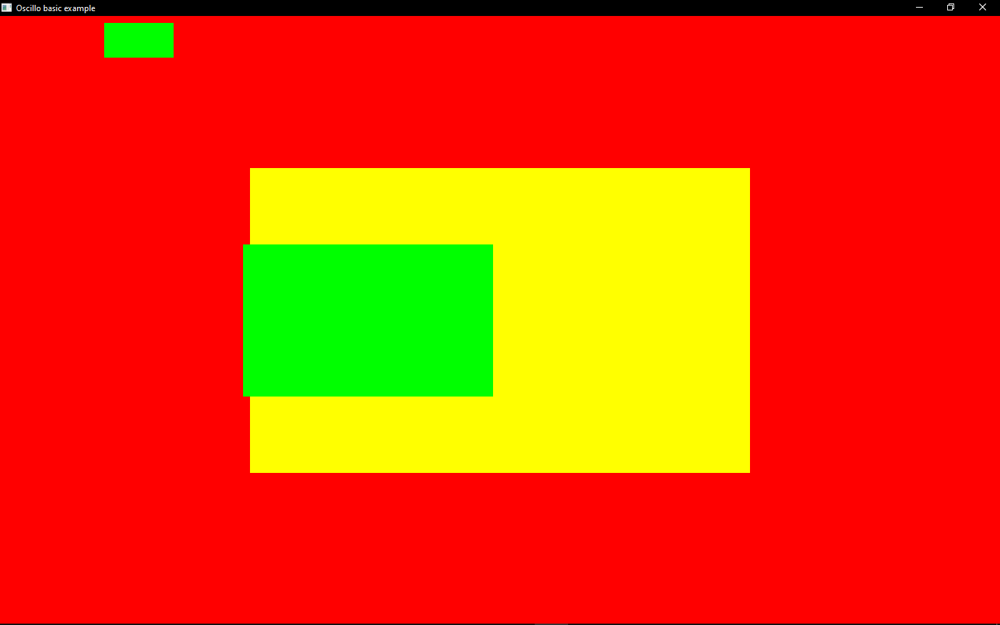

# Oscillo

2D Graphics engine test

The goal is to render a simple web page in the future, so the design idea of the code is based on css and html elements.

## Examples

- Basic

    
    
    ```bash
    cargo run --example basic
    ```
    ```rust
        use oscillo_core::{Script, Context, Key, App, Color, BackgroundType, Element};

        pub struct MainScript {
            root: Element
        }
        impl Script for MainScript {
            fn setup(&self, _: Context) {
                self.root.style.background.set(BackgroundType::Solid(Color::RED));
                {
                    let c = self.root.create_child();
                    c.style.background.set(BackgroundType::Solid(Color::GREEN));
                    c.style.width.set_px(100.);
                    c.style.height.set_px(50.);
                    c.style.x.set_px(150.);
                    c.style.y.set_px(10.);
                }
                {
                    let c = self.root.create_child();
                    c.style.background.set(BackgroundType::Solid(Color::YELLOW));
                    c.style.width.set_perc(0.5);
                    c.style.height.set_perc(0.5);
                    c.style.x.set_perc(0.25);
                    c.style.y.set_perc(0.25);
                    {
                        let c = c.create_child();
                        c.style.background.set(BackgroundType::Solid(Color::GREEN));
                        c.style.width.set_perc(0.5);
                        c.style.height.set_perc(0.5);
                        c.style.x.set_px(-10.);
                        c.style.y.set_perc(0.25);
                    }
                }
            }
            fn update(&self, c: Context) {
                if c.is_key_pressed(&Key::Escape) {
                    c.exit()
                }
                if c.is_key_pressed(&Key::P) {
                    c.screenshot(256, 256)
                }
            }
        }

        fn main() {
            oscillo_core::logger().init();
            let app = App::new();
            app.context.window.set_title("Oscillo basic example");
            let container = app.context.new_container();
            container.add_script(MainScript {
                root: container.root.clone()
            });
            app.run()
        }
    ```